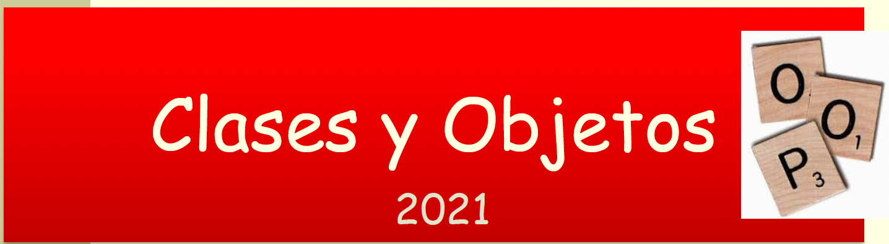
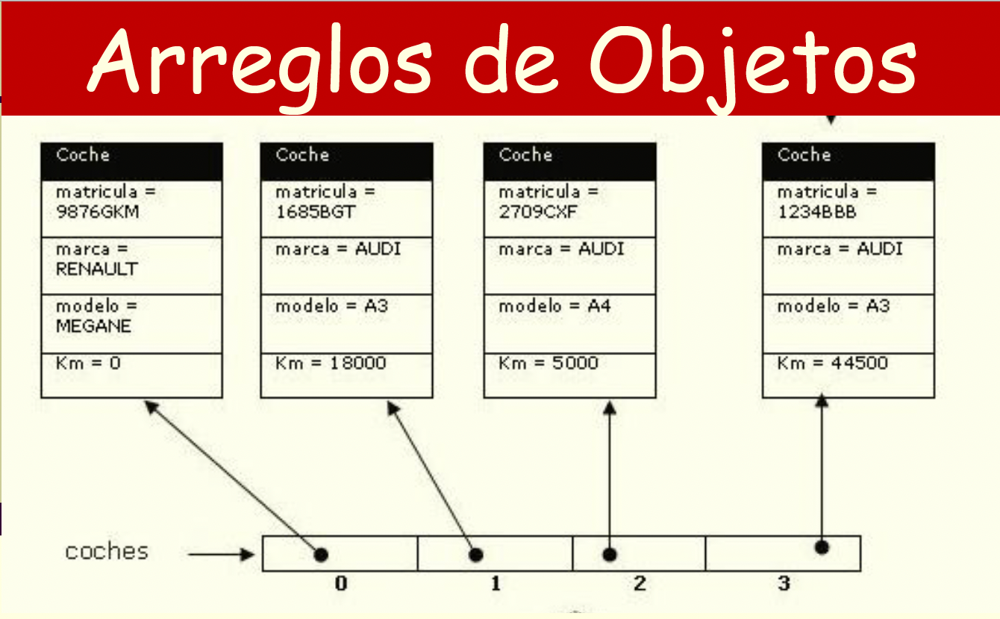

# TC1033-MATERIAL

- [Funciones c++](https://drive.google.com/file/d/1nTqMB1emVW0om0Rm7x1r2DG3ctfUXgsj/view?usp=sharing)

- [https://www.lucidchart.com/pages/es/tutorial-de-diagrama-de-clases-uml#discovery__top](https://www.lucidchart.com/pages/es/tutorial-de-diagrama-de-clases-uml#discovery__top)
- [https://www.learncpp.com/](https://www.learncpp.com/)
- [https://www.learncpp.com/cpp-tutorial/passing-arguments-by-reference/](https://www.learncpp.com/cpp-tutorial/passing-arguments-by-reference/)
- [https://www.learncpp.com/cpp-tutorial/the-hidden-this-pointer/](https://www.learncpp.com/cpp-tutorial/the-hidden-this-pointer/)
- [http://www.cplusplus.com/doc/tutorial/](http://www.cplusplus.com/doc/tutorial/)
- [https://www.markdownguide.org/cheat-sheet/](https://www.markdownguide.org/cheat-sheet/)
- [https://elcodigoascii.com.ar/](https://elcodigoascii.com.ar/)
- [https://docs.github.com/es/get-started/quickstart/hello-world](https://docs.github.com/es/get-started/quickstart/hello-world)

# 1. Introducción a Clases y Objetos en C++
# 2. Más sobre Clases y Objetos
____

# 3. Composición
______

# 4. Arreglos de Objetos
____

# 5. Herencia

# 6. Poliformismo

![alt_text][Siete.png]
# 7. Sobrecarga

https://www.markdownguide.org/cheat-sheet/
